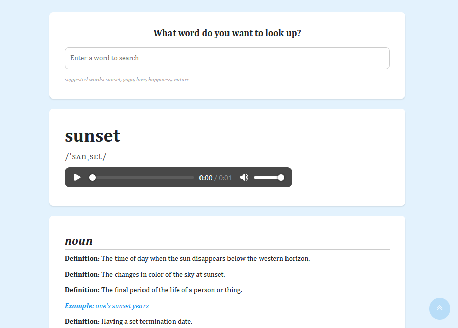
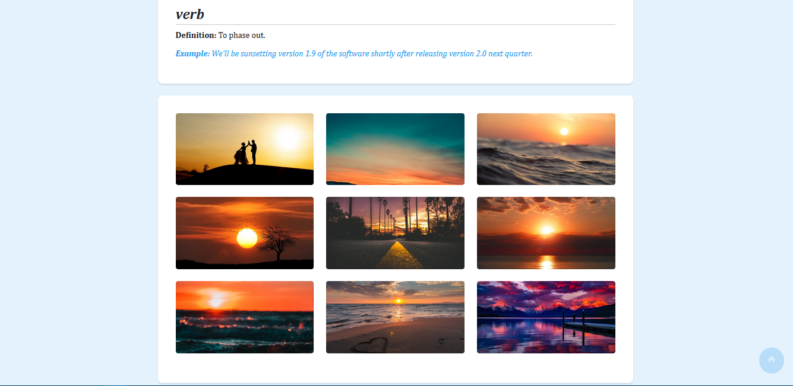

## 📍 React Dictionary

  💡 Responsive web application that allows users to search for word meanings through an interactive search tool. It displays the definition and pronunciation of each word, as well as related images.   
  👉🏽 Built with HTML, CSS, React.js, Pexels API, and Free Dictionary API.  
  📌 The website is hosted on <a href="https://my-super-dictionary.netlify.app/">Netlify</a>

### React Dictionary 📚

### Dictionary Images 📷

